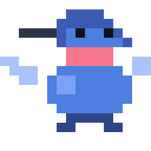

# Meet the Mascot 🐦



## Phae, the Trap-liner — Knows Which Flowers Have Refilled

> **Meet the Hermit** 🐦
> "I keep a circuit. I know every flower on it, I know when I last drained each one, and I know which ones have filled back up. I'm not lost out here. I'm working a route."

### Who Is This Animal?

Meet Phae — a hermit hummingbird, genus *Phaethornis*, a bird whose entire foraging
strategy is the problem this tool solves. Hermits don't defend one patch. They
**trap-line**: they work a long, repeatable circuit of widely scattered flowers,
returning to each one on its own schedule.

Which means a hermit is not tracking *where the food is*. It's tracking **where the
food is, and when I was last there, and therefore whether it's worth going back yet** —
across dozens of sites held in parallel, with no two on the same clock.

That's the switcher. Not "list my sessions." *Which of these is worth returning to now.*

Fun fact: this isn't a stretch metaphor bolted on afterwards. Rufous hummingbirds
studied by Healy and Hurly were shown to remember not just which flowers they'd
visited but **how long ago**, and to time their returns to each flower's refill rate.
Location plus elapsed time, per site, in parallel. The biology and the architecture
are the same diagram — the bird just got there about forty million years earlier.

### Hummingbird Facts (With Session-Switching Translation)

**Fact #1:** Hermits trap-line — a repeatable circuit of scattered flowers rather
than one defended patch. Their whole economy assumes many sites, none of them home.
**Translation:** The switcher assumes you have a dozen things open across a dozen
directories, and that this is *fine*. It doesn't ask you to consolidate. It makes the
return trip cheap.

> "I don't have a territory. I have a route."

*Roast:* Holds an entire foraging circuit in a brain the size of a grain of rice. This
tool needs a 53 KB index, a schema version and a cache-invalidation rule to hold
thirteen files.

---

**Fact #2:** They track elapsed time per flower, returning as each one refills rather
than on a fixed loop.
**Translation:** Every row carries its own last-active time and a 16-cell strip of
when in its life the session was busy. A burst-then-idle debugging session and a
steady refactor read differently at a glance, before you read a word.

> "That one's still empty. I was there twenty minutes ago."

*Confession:* Times its returns by an internal clock accurate to the minute. The
strip folds everything into sixteen cells and calls it a day.

---

**Fact #3:** A hummingbird's blue-green isn't pigment — it's structural colour. The
same feather is a different colour depending on the angle you view it from.
**Translation:** Project colours are hashed, so one list shows one hue per repo and
the same repo is always the same hue. One bird, many colours, depending where you
look from.

> "Same feathers. You just moved."

*Roast:* Produces iridescence from the physical structure of keratin. We do it with
`charCodeAt` and a modulo.

---

**Fact #4:** They hover — wings at fifty beats a second — precisely so they never have
to commit to landing.
**Translation:** `/switcher #wip` is registered `immediate`, so you can mark a session
while a turn is still streaming. Tag it without landing on it.

> "I'm not stopping. I'm just marking this one."

*Contradiction:* Sustains hovering flight, the most metabolically expensive movement
of any vertebrate, indefinitely. Cannot read a file over 4 MiB without shelling out to
`sed`.

---

**Fact #5:** Hermits are among the plainest hummingbirds — no flashing display, long
curved bill, drab olive-brown. They're built for the route, not for the show.
**Translation:** This is a list in a pane. No animation, no chrome, two lines a row.
The point is the trip home, not the plumage.

> "The pretty ones are defending a hedge somewhere. I've got eleven kilometres to
> cover before dark."

*Roast:* Admirably unshowy. Immediately rendered in eight colours and given a
gorget it does not, strictly speaking, have.

---

**Fact #6:** A hummingbird enters torpor overnight — heart rate and body temperature
dropping until it is barely alive — because holding that much readiness is
unaffordable when nothing is happening.
**Translation:** The index sleeps. Opening the switcher reads no transcript at all,
just the cached index and a `stat` per file. It wakes only for what changed.

> "I'm not dead. I'm just not spending anything."

*Confession:* Drops its heart rate from 1,200 to 50 to survive a cold night. Our
version of thrift is not re-reading a file whose mtime hasn't moved.

---

## The Pixels

Sixteen by sixteen, eight colours, in the same family as Claude Code's own terminal
sprite: stout stacked squares, two black eyes, legible at the size a pane will draw
it. The long bill, the gorget band, the forked tail and the wingbeat blur are the
only four cues that separate a hummingbird from a blue blob, so those are the four
the sprite spends its pixels on.

The palette is not decorative. `#7aa2f7` is the first entry in the switcher's own
project-hue table — the mascot is wearing the colour your first project is drawn in.

```
.......DDDD.....      D  crown     #3b5bb5
......DDDDDD....      B  body      #4c7fe0
..YYYYDBKBBKD...      L  sheen     #7aa2f7   ← project hue 1
......DBBBBBBD..      W  wingbeat  #a9c4fb
.......GGGGG....      G  gorget    #f7768e   ← project hue 6
WW.....GGGGG..WW      T  tail      #2f4487
.WWW..BBBBBBB.WW      K  eye       #11131a
..WW.BLLBBBBBB..      Y  bill      #2f3549
.....BLLBBBBBB..
.....BBBBBBBBB..      The grid is the source. Edit it, regenerate
......BBBBBBB...      the SVG, and the run-merging keeps it to
.......TTTTT....      about thirty rects.
......TT...TT...
```
